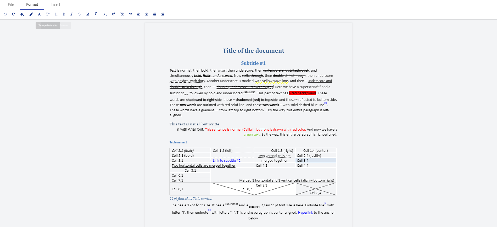

# UI for GroupDocs.Editor for .NET




GroupDocs.Editor UI is a rich UI interface that designed to work in conjunction with [GroupDocs.Editor for .NET](https://products.groupdocs.com/editor/net) to display most popular Word documents (DOC, DOCX, RTF, ODT etc) formats in a browser.

To integrate GroupDocs.Editor UI in your ASP.NET Core project you just need to add services and middlewares into your `Startup` class that provided in `GroupDocs.Editor.UI` .

Include packages in your project:

```PowerShell
dotnet add package GroupDocs.Editor.UI.Api
```

Add configuration to your `Startup` class:

```cs
var builder = WebApplication.CreateBuilder(args);

// Add services to the container.
builder.Services.AddEditorControllers();
builder.Services.AddEditorSwagger();
builder.Services.AddEditor<LocalStorage>(builder.Configuration);
```

## UI

The UI is Angular application that is build upon [@groupdocs/groupdocs.editor.angular.ui-wordprocessing
](https://www.npmjs.com/package/@groupdocs/groupdocs.editor.angular.ui-wordprocessing) package. 


## API

The API is used to serve content such as to open, view, edit content, and save Word documents. The API can be hosted in the same or a separate application. The following API implementations available at the moment:

- [GroupDocs.Editor.UI.Api](dotnet add package GroupDocs.Editor.UI.Api)

All the API implementations are extensions of `IMvcBuilder`:


GroupDocs.Editor for .NET requires license to skip [trial limitations](https://docs.groupdocs.com/editor/net/evaluation-limitations-and-licensing-of-groupdocs-editor/). A temporary license can be requested at [Get a Temporary License](https://purchase.groupdocs.com/temporary-license).

Use the following code to set a license in the appsetting.json:

```json
"LicenseOptions": {
    "Type": 1, // see posible option bellow
    "Source": "https://docs.groupdocs.com/editor/net/licensing-and-subscription/"
  },
```

```cs
public enum LicenseSourceType
{
    /// <summary>
    /// The license stored locally.
    /// </summary>
    LocalPath = 0,

    /// <summary>
    /// The license stored remote and we should reed it by URL
    /// </summary>
    RemoteUrl = 1,

    /// <summary>
    /// The license stored base64 string
    /// </summary>
    Base64 = 2,
}
```


#### Linux dependencies

When running API on Linux or in Docker the following packages have to be installed:

```bash
RUN apt-get update && apt-get install -y libgdiplus

RUN sed -i'.bak' 's/$/ contrib/' /etc/apt/sources.list
RUN apt-get update; apt-get install -y ttf-mscorefonts-installer fontconfig
RUN fc-cache -f -v
```

### Amazon S3 Storage

```cs
builder.Services.AddEditor<AwsS3Storage>(builder.Configuration);
```

specify option in the appsetting.json for file storage folder

```json
"AWS": {
    "Profile": "s3-dotnet-demo",
    "Region": "us-west-2",
    "BucketName": "groupDocs-editor-files"
  },
```


#### API Storage Providers

```cs
builder.Services.AddEditor<LocalStorage>(builder.Configuration);
```

specify option in the appsetting.json for file storage folder and base url for read files

```json
"LocalStorageOptions": {
    "RootFolder": "pathToStorage",
    "BaseUrl": "https://yourBaseUrl"
  },
```


## Contributing

Your contributions are welcome when you want to make the project better by adding new feature, improvement or a bug-fix.

1. Read and follow the [Don't push your pull requests](https://www.igvita.com/2011/12/19/dont-push-your-pull-requests/)
2. Follow the code guidelines and conventions.
3. Make sure to describe your pull requests well and add documentation.
